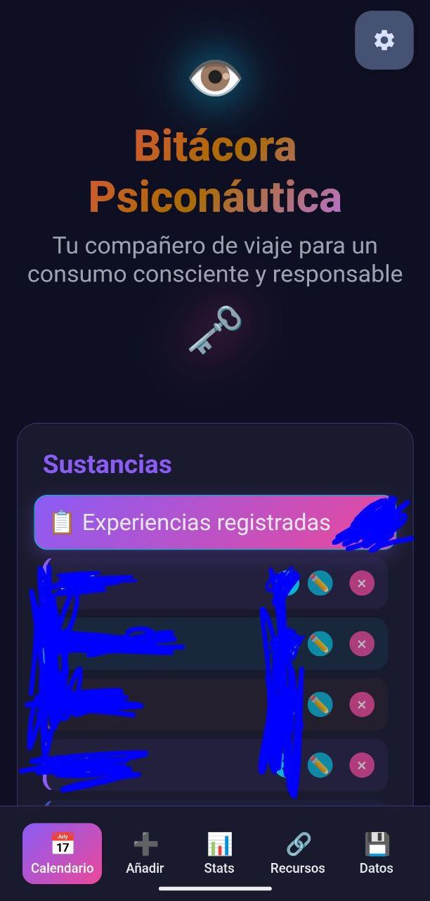
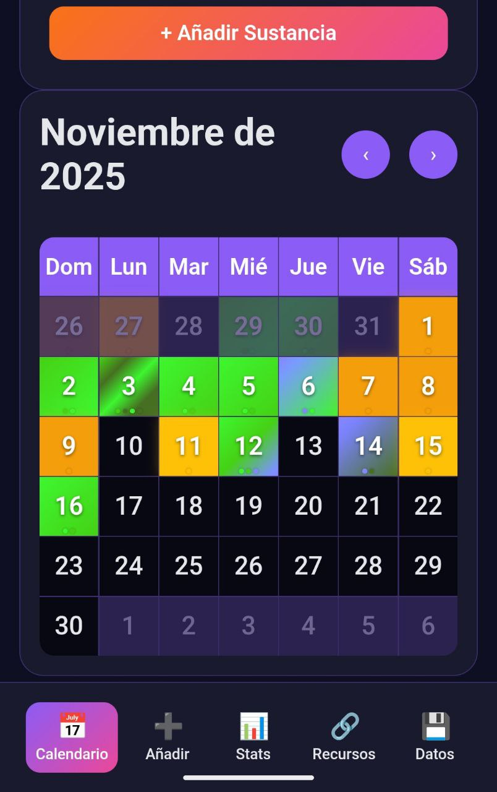
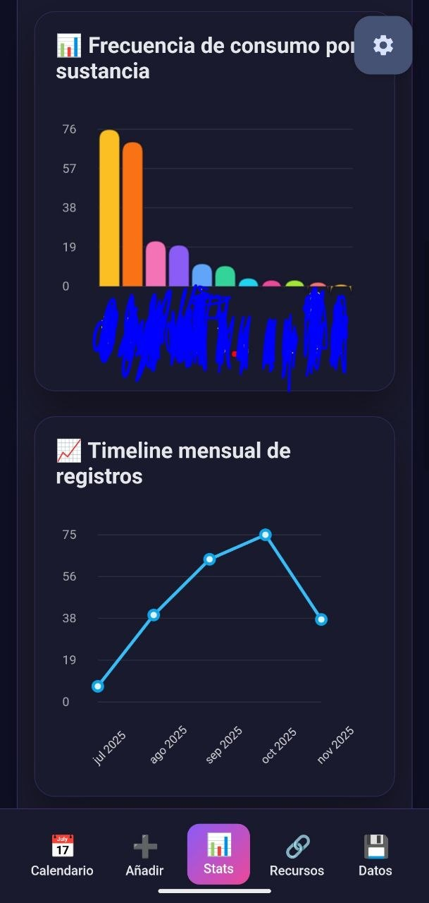
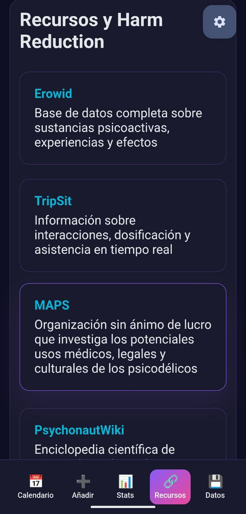
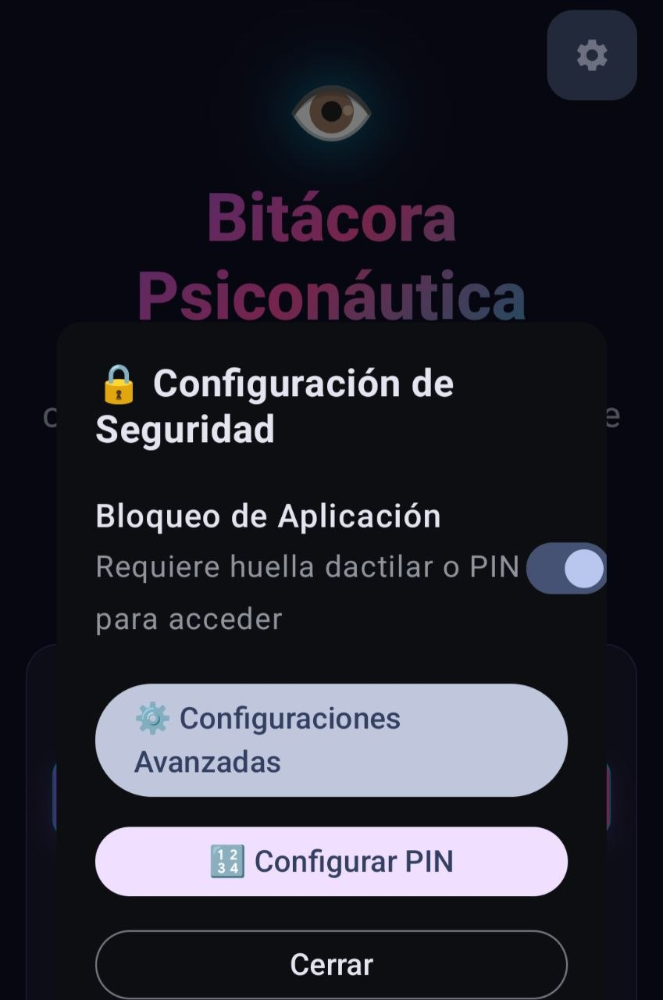
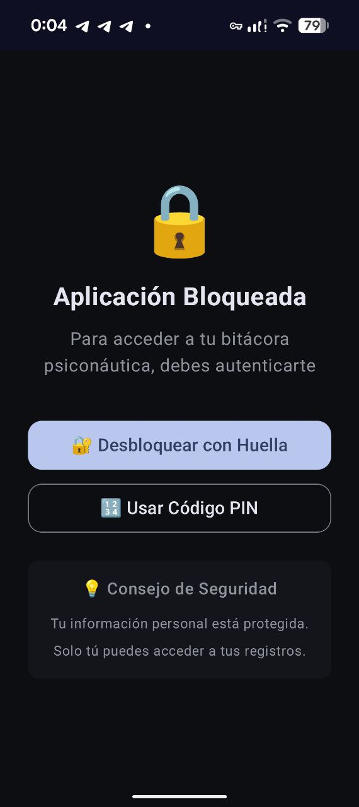
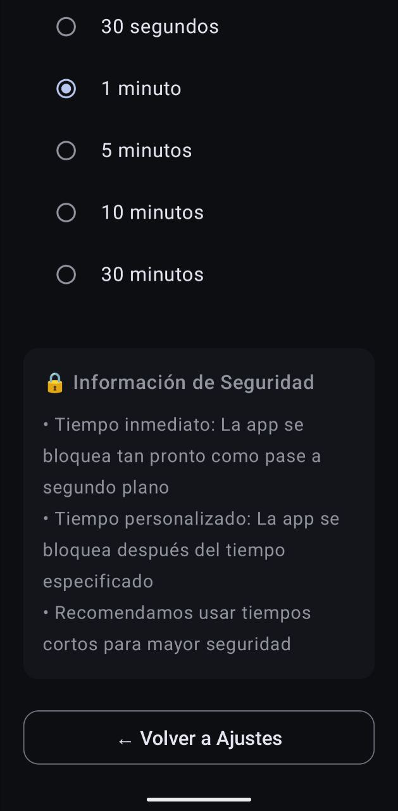

# PsychoLogger 🧠💫📊🌌


[](https://www.gnu.org/licenses/gpl-3.0)
[](https://www.android.com)
[](https://kotlinlang.org)
[](https://en.wikipedia.org/wiki/Advanced_Encryption_Standard)
[](https://opensource.org)
[](https://claude.ai/code)
[](https://chat.openai.com)
[](https://en.wikipedia.org/wiki/Project-based_learning)


[🇬🇧🇺🇸 English version](README_English-version.md)

## Tabla de Contenidos
- [¿Qué es PsychoLogger?](#qué-es-psychologger)
- [Características Principales](#características-principales)
- [Instalación](#instalación)
- [Cómo Usar](#cómo-usar-psychologger)
- [Tecnología](#tecnología)
- [Privacidad y Seguridad](#privacidad--seguridad)
- [Reducción de Daños](#importante-reducción-de-daños)
- [Desencriptar Backups](#-desencriptar-backups-de-audios-cifrados)
- [Contribuir](#contribuir)

## ¿Qué es PsychoLogger?

**PsychoLogger** es una aplicación Android de código abierto diseñada como una bitácora personal segura para experiencias psiconáuticas. Desarrollada en **Kotlin** y **Jetpack Compose**, esta herramienta permite a los usuarios documentar, analizar y entender sus experiencias con sustancias psicoactivas de manera responsable, privada y segura.

Ideal para investigación personal, reducción de riesgos y seguimiento de patrones de consumo.

## ¿Por qué usar PsychoLogger?

### 🔒 Privacidad Total y Cifrado
- **Offline First**: Todos tus datos quedan en tu dispositivo. Nada se sube a la nube.
- **Seguridad Biométrica**: Protección con huella dactilar o reconocimiento facial.
- **Cifrado AES-256**: Cifrado de grado militar para tus registros más sensibles y backups.

### 📝 Registro Detallado (Logging)
- **Bitácora Completa**: Registra sustancia, dosis, fecha, hora, y método de administración.
- **Set & Setting**: Documenta tu estado mental ("set") y el ambiente ("setting").
- **Diario Psiconáutico**: Agrega notas personales y observaciones detalladas.
- **Categorización Visual**: Organiza sustancias con colores y emojis personalizados.

### 📈 Análisis y Estadísticas
- **Visualización de Datos**: Historial interactivo en calendario.
- **Patrones de Uso**: Estadísticas para entender mejor tus hábitos y promover el consumo responsable.

### 🔗 Recursos de Reducción de Riesgos (RdR)
Acceso directo a información vital de fuentes confiables:
- **Erowid**: Base de datos de sustancias.
- **TripSit**: Asistencia en tiempo real e interacciones.
- **MAPS**: Investigación científica sobre psicodélicos.
- **PsychonautWiki**: Enciclopedia de efectos y dosis.

## Características Principales

### 🏠 Interfaz Híbrida Moderna
Combina la potencia de Android nativo con una interfaz fluida y responsiva. Diseño intuitivo centrado en la experiencia de usuario (UX).

### 💊 Gestión Personalizada de Sustancias
Incluye preajustes (LSD, Ketamina, etc.) y permite crear nuevas entradas:
- Psicodélicos 🍄
- Estimulantes/MDMA ⚡
- Disociativos 🌀
- Depresores 😴

### 📊 Control Total de Datos
- **Exportación CSV**: Tus datos son tuyos. Expórtalos para análisis externo.
- **Backups Cifrados**: Copias de seguridad seguras.
- **Migración Sencilla**: Mueve tus datos entre dispositivos fácilmente.

### 🛡️ Seguridad Avanzada
- **Biometría**: Huella/Cara.
- **PIN de Respaldo**: SHA-256 hashed.
- **Auto-bloqueo**: Configurable para máxima privacidad.
- **Stealth Mode**: Diseño discreto.

## 📸 Capturas de Pantalla

<p align="center">
  
  
  
</p>

<p align="center">
  
  
  
</p>

<p align="center">
  
  
  
</p>

<p align="center">
  
  
  
</p>

<p align="center">
  
  
  
</p>


## Instalación

### Lo que Necesitas
- Android 7.0 o más reciente
- 3MB de espacio, que aumentará levemente a medida que añadas datos.
- Sensor biométrico (recomendado pero no obligatorio)

### Cómo Instalar
1. Descarga el APK o clona este repo
2. Si compilas desde código: Android Studio + Gradle
3. Instala en tu dispositivo
4. Configura tu PIN y biometría en el primer uso para mayor privacidad
=======
### Requisitos
- **OS**: Android 7.0 (Nougat) o superior.
- **Espacio**: ~ 3MB *(con unos 3 meses de datos llega solo a 10MB, por poner un ejemplo).*
- **Hardware**: Sensor biométrico recomendado.

### Pasos
1. Descarga el APK de la sección [Releases](https://github.com/D4VRAM369/PsychoLogger/releases) o clona este repositorio.
2. Si compilas desde el código fuente:
   ```bash
   git clone https://github.com/D4VRAM369/PsychoLogger.git
   cd PsychoLogger
   ./gradlew assembleRelease
   ```
3. Instala el APK en tu dispositivo.
4. Configura tu seguridad inicial (PIN/Biometría).

### Firma y Ofuscación
Para desarrolladores que compilan su propia versión:
1. Configura `gradle.properties` con tus claves de firma.
2. Ejecuta `./gradlew assembleRelease`.
3. R8 optimizará y ofuscará el código automáticamente.


## Cómo Usar PsychoLogger

1. **Inicio Seguro**: Autentícate al abrir la app.
2. **Registro**: Pulsa "+" para nueva entrada. Selecciona sustancia, dosis y añade notas.
3. **Revisión**: Usa el calendario o las estadísticas para ver tu historial.
4. **Recursos**: Consulta la sección de información para dudas sobre sustancias.

## Tecnología

Este proyecto es un excelente ejemplo de desarrollo Android moderno:
- **Lenguaje**: [Kotlin](https://kotlinlang.org/)
- **UI Toolkit**: [Jetpack Compose](https://developer.android.com/jetpack/compose) & Material Design 3
- **Seguridad**: AndroidX Security (EncryptedSharedPreferences, MasterKey)
- **Arquitectura**: MVVM (Model-View-ViewModel)
- **Build System**: Gradle Kotlin DSL

## Importante: Reducción de Daños

PsychoLogger está pensada para:
- ✅ **Educación** sobre sustancias psicoactivas
- ✅ **Reducción de riesgos** mediante documentación
- ✅ **Autoconocimiento** y patrones personales
- ✅ **Investigación responsable**

❌ **NO promovemos el uso recreativo** de ninguna sustancia

❌ **NO sustituye asesoramiento médico** profesional

❌ **NO es para menores de edad**

## Datos Técnicos

### 💊 Substance Management  
Includes predefined substances (LSD, Ketamine, Opium), and you can add your own:
- Psychedelics 🍄  
- Stimulants/MDMA ⚡  
- Dissociatives 🌀  
- Depressants 😴  

### 📊 Your Data, Your Control  
- **Export** everything to CSV anytime  
- **Import** data from other formats  
- **Migrate** easily between devices  
- **Backup** your information locally and securely  

### 🛡️ Meaningful Security  
- **Biometric unlock:** fingerprint, face, etc.  
- **Backup PIN**  
- **Auto-lock:** closes itself after inactivity  
- **Secure entry point:** verification required every time  

---

## 📸 Screenshots

<p align="center">
  
  
  
</p>

<p align="center">
  
  
  
</p>

<p align="center">
  
  
  
</p>

<p align="center">
  
  
  
</p>

<p align="center">
  
  
  
</p>


## Installation

### Requirements
- Android 7.0 or higher  
- About 20MB of storage  
- Biometric sensor (recommended but not required)  

### How to Install
1. Download the APK or clone this repo  
2. If building from source: Android Studio + Gradle  
3. Install on your device  
4. Set your PIN and biometrics on first launch  

## How to Use PsychoLogger

### First Time
1. **Set up your security** – Choose a PIN and enable biometrics  
2. **Add your substances** – Customize them with colors and emojis  
3. **Adjust preferences** – Auto-lock time, etc.

### Daily Use
1. **Open the app** – Authenticate with fingerprint or PIN  
2. **Log your experience** – Substance, dose, context, notes  
3. **Review your data** – Calendar, graphs, statistics  
4. **Export** when you need a backup

## Technology

Built using modern Android technologies:
- **Kotlin** as the main language  
- **Jetpack Compose** for smooth native UI  
- **Material 3** for a clean and familiar design  
- **AndroidX Encryption** for maximum security  
- **Hybrid WebView** for the main interface  

## Important: Harm Reduction

PsychoLogger is designed for:
- ✅ **Education** about psychoactive substances  
- ✅ **Harm reduction** through documentation  
- ✅ **Self-knowledge** and understanding patterns  
- ✅ **Responsible research**  

It is NOT:
- ❌ A promotion of recreational use  
- ❌ A replacement for professional medical advice  
- ❌ Intended for minors  

## Technical Details

### Current Version: 1.0
- **Package:** com.d4vram.psychologger  
- **Target:** Android 14 (API 36)  
- **Minimum:** Android 7.0 (API 24)  
- **Size:** = 3MB installed


### Data Structure
Your entries are stored in a structured way:
=======
### Versión Actual: 1.0
- **Package:** com.d4vram.psychologger
- **Objetivo:** Android 14 (API 36)
- **Mínimo:** Android 7.0 (API 24)
- **Tamaño:** ~ 3MB instalada 

### Estructura de Datos
Tus registros se guardan de forma estructurada:
```
📁 Sustancias (nombre, color, emoji, fecha)
📁 Entradas (sustancia, dosis, fecha, set, setting, notas)
📁 Preferencias (configuración personal)
```

## Privacidad & Seguridad

### Tu Privacidad Es Sagrada
- **Cero telemetría** - No enviamos datos a ningún servidor
- **Local únicamente** - Todo queda en tu teléfono
- **Sin conexiones externas** - La app funciona completamente offline
- **Cifrado robusto** - AES256 para datos sensibles

### Controles de Seguridad
- **Autenticación multicapa** (biométrica + PIN)
- **Hash seguro** de PINs (SHA-256)
- **Auto-lock inteligente** configurable
- **Verificación de integridad** en cada arranque

## Contribuir

¿Quieres mejorar PsychoLogger? Las contribuciones son bienvenidas:
1. Fork del repositorio
2. Crea una rama para tu feature
3. Sigue las convenciones de Kotlin/Android
4. Envía tu PR con descripción detallada

## Soporte

¿Problemas? ¿Sugerencias? ¿Bugs?
- Abre un issue en GitHub
- Contacta al desarrollador
- Revisa la documentación técnica
=======
PsychoLogger es una herramienta de **Reducción de Riesgos y Daños**.
- ✅ **Educación e Investigación**
- ✅ **Autoconocimiento**
- ❌ **NO promueve el uso ilegal de sustancias**
- ❌ **NO sustituye consejo médico**


## 🔓 Desencriptar Backups de Audios Cifrados

Los audios exportados se cifran con **AES-256-GCM**. Usa el script de Python incluido para recuperarlos.

### Requisitos
```bash
pip3 install cryptography
```

### Uso
```bash
python3 decrypt_psychologger.py audios_encrypted_2025-01-15.zip
```
El script derivará la clave de tu contraseña y extraerá los audios originales.

## Privacidad & Seguridad

- **Cero Rastreadores**: No hay analytics ni trackers.
- **Local Storage**: Base de datos SQLite/Room local.
- **Código Abierto**: Auditable por cualquiera.

## Contribuir

¡Las contribuciones son bienvenidas! Ayuda a mejorar esta herramienta para la comunidad.
Consulta [CONTRIBUTING.md](CONTRIBUTING.md) para guías de contribución.

1. Haz un Fork.
2. Crea tu rama (`git checkout -b feature/AmazingFeature`).
3. Commit (`git commit -m 'Add some AmazingFeature'`).
4. Push (`git push origin feature/AmazingFeature`).
5. Abre un Pull Request.

## Soporte

Si encuentras un bug o tienes una idea, por favor abre un [Issue](https://github.com/D4VRAM369/PsychoLogger/issues).

---
*Desarrollado con ❤️ para la comunidad psiconáutica responsable.*
