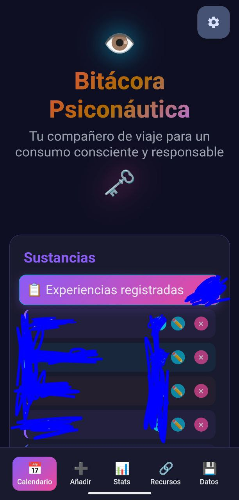
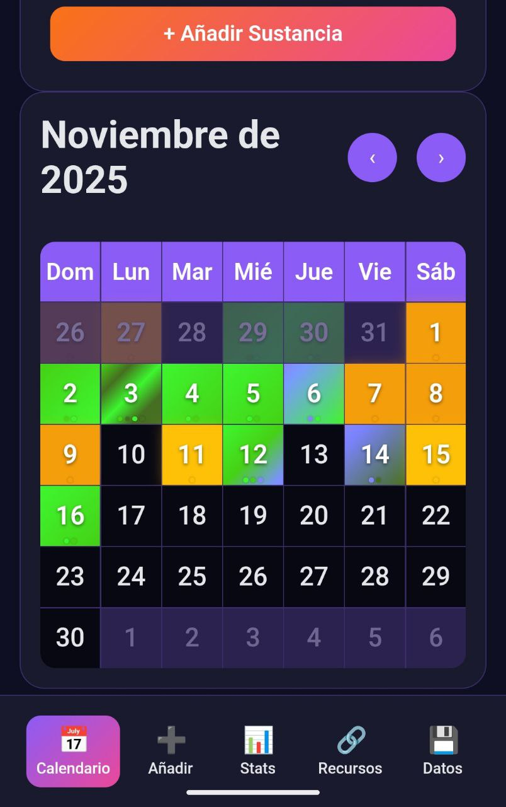
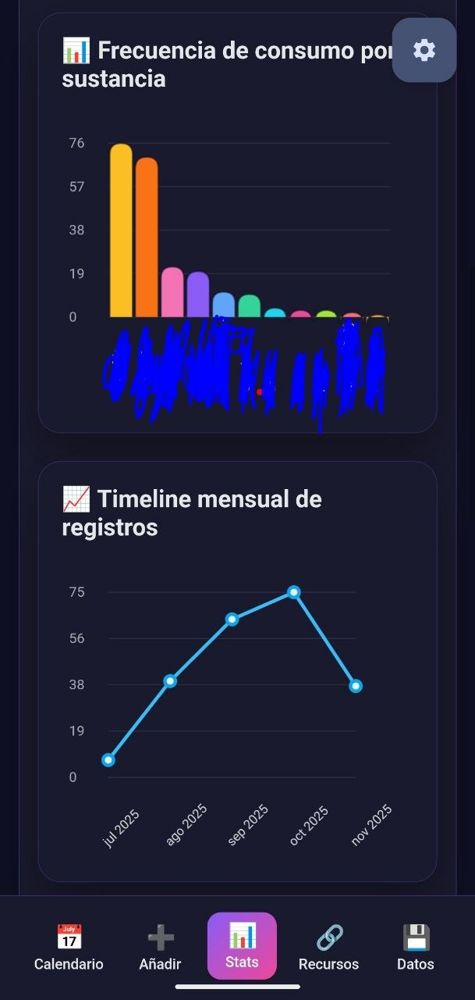
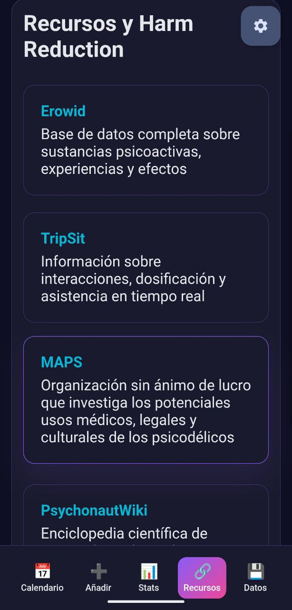
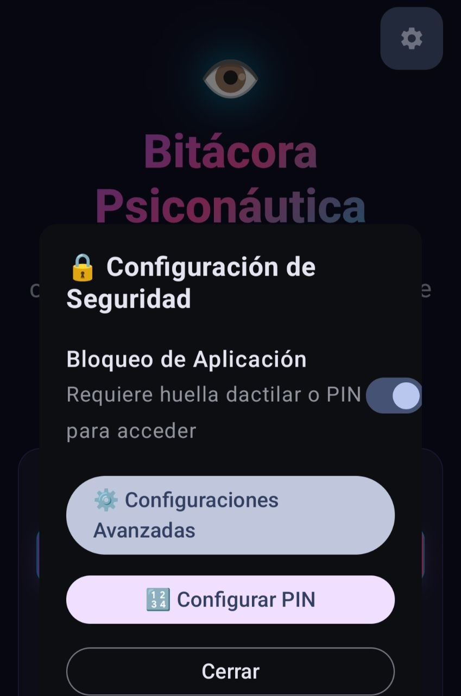
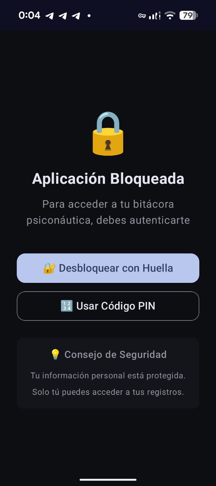
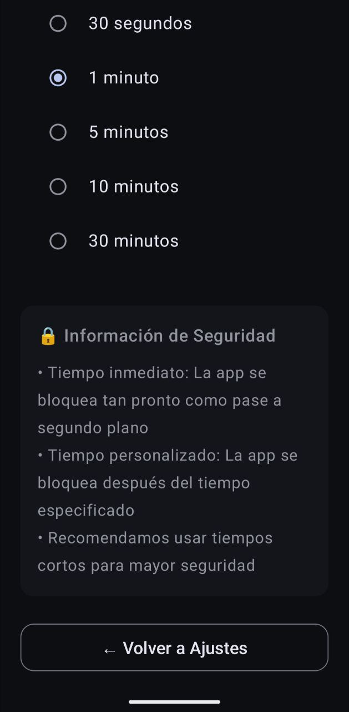

# PsychoLogger 🧠📊


[](https://www.gnu.org/licenses/gpl-3.0)
[](https://www.android.com)
[](https://kotlinlang.org)
[](https://opensource.org)
[](https://claude.ai/code)
[](https://chat.openai.com)
[](https://en.wikipedia.org/wiki/Project-based_learning)


[🇮🇨🇪🇸 Spanish version](README_Spanish.md)

---

## 🆕 What's New in v1.3

| Feature | Description |
|---------|-------------|
| ✍️ **Better Markdown Notes** | Improved code block rendering when selecting and formatting text |
| 📁 **SAF File Picker** | Migrated to Storage Access Framework for better compatibility |
| 📐 **Responsive DateTime Picker** | Buttons now adapt properly to mobile screens |
| 💾 **Backup Export Fix** | CSV export now works correctly in Advanced Backup |
| 🏪 **IzzyOnDroid** | Submitted for review on F-Droid's IzzyOnDroid repository |

### v1.2 Highlights

| Feature | Description |
|---------|-------------|
| ⏰ **Time Travel Picker** | Log forgotten experiences with visual calendar and quick date buttons |
| 🔀 **Drag & Drop** | Reorder your substance list by dragging |
| 📦 **Archive Substances** | Triple-tap on ⋮⋮ to hide substances without losing records |
| 🧹 **Data Cleanup Tool** | Scan and fix corrupted entries in Settings > Data |

> 📋 [Full changelog](CHANGELOG.md) · 📥 [Download latest release](https://github.com/D4vRAM369/PsychoLogger/releases/latest)

---

## What is PsychoLogger?

PsychoLogger is your personal logbook for psychonaut experiences. An Android app designed for those who want to document and understand their experiences with psychoactive substances in a responsible and safe way.

---

## Why use PsychoLogger?

### 🔒 Total Privacy
- All your data stays **on your device** — nothing is uploaded to the internet  
- Protected with fingerprint or PIN  
- Military-grade encryption for your most sensitive entries  

### 📝 Complete Logging
- Record substance, dose, date, and time  
- Document your **set** (mindset) and **setting** (environment). Add custom sets and settings to your apk.
- Add personal daily notes with each entry, and/or use it as a complementary “psychonaut diary”. Markdown buttons and format are implemented on them.
- Audio record and pictures uploads/camera are available to save and able to use in personal notes.
- Categorize your substances with colors and emojis  

### 📈 Visualize Your Patterns
- Explore your history through an interactive calendar  
- Statistics to better understand your habits  

### 🔗 Attached Harm Reduction Resources  
Links to well-known harm-reduction and information websites:

- **Erowid** – Extensive database on psychoactive substances  
- **TripSit** – Interaction info, dosage guidelines, and real-time assistance  
- **MAPS** – Research on medical, legal, and cultural uses of psychedelics  
- **PsychonautWiki** – Scientific encyclopedia of psychoactive substances

  > - ⚠️ This is the only reason why the apk requests Internet permissions. You can recompile it on your own (always following the license guidelines) and remove the redirection to the websites that I considered appropriate, thus dispensing with the Internet permission.
  > - 🤔 I kindly encourage skeptics to search the source code or send it to any AI, and they will find that what I say is true.
  > - 🗣 I understand that Internet permissions in this application may raise some eyebrows, given the necessary and intrinsic privacy that a personal registration app of any kind requires.
  > - 🔎 In addition to encouraging you to look at the code and/or send it to any AI to review the entire source code, I also encourage you, if you still have any reservations, to choose one of these two options: block the app's Internet permissions if your mobile operating system allows it.
  > - If not, I recommend Netguard: open source, reliable, space-efficient, and effective.
  > - ‼️ Ultimately, if there are users who want to use the app and would use it if it weren't for this, please open an issue and let me know that despite everything I've said, you still consider it a problem for your privacy. At the moment, the only Internet permission required by the application is link redirection, although I have future plans to be able to link data to the cloud perhaps later on. For now, I wanted to make this clear ✍️📌
---


## Main Features

### 🏠 Main Screen  
The app blends native Android elements with a smooth web-based interface. Your security is guaranteed from the moment you open the app.

### 💊 Substance Management  
Includes predefined substances (LSD, Ketamine, Opium), and you can add your own:
- Psychedelics 🍄  
- Stimulants/MDMA ⚡  
- Dissociatives 🌀  
- Depressants 😴  

### 📊 Your Data, Your Control  
- **Export** everything to CSV anytime  
- **Import** data from other formats  
- **Migrate** easily between devices  
- **Backup** your information locally and securely  

### 🛡️ Meaningful Security  
- **Biometric unlock:** fingerprint, face, etc.  
- **Backup PIN**  
- **Auto-lock:** closes itself after inactivity  
- **Secure entry point:** verification required every time  

---

## 📸 Screenshots

<p align="center">
  
  
  
</p>

<p align="center">
  
  
  
</p>

<p align="center">
  
  
  
</p>

<p align="center">
  
  
  
</p>

<p align="center">
  
  
  
</p>


## Installation

### Requirements
- Android 8.0 or higher
- About 20MB of storage
- Biometric sensor (recommended but not required)  

### How to Install
1. Download the APK or clone this repo  
2. If building from source: Android Studio + Gradle  
3. Install on your device  
4. Set your PIN and biometrics on first launch  

## How to Use PsychoLogger

### First Time
1. **Set up your security** – Choose a PIN and enable biometrics  
2. **Add your substances** – Customize them with colors and emojis  
3. **Adjust preferences** – Auto-lock time, etc.

### Daily Use
1. **Open the app** – Authenticate with fingerprint or PIN  
2. **Log your experience** – Substance, dose, context, notes  
3. **Review your data** – Calendar, graphs, statistics  
4. **Export** when you need a backup

## Technology

Built using modern Android technologies:
- **Kotlin** as the main language  
- **Jetpack Compose** for smooth native UI  
- **Material 3** for a clean and familiar design  
- **AndroidX Encryption** for maximum security  
- **Hybrid WebView** for the main interface  

## Important: Harm Reduction

PsychoLogger is designed for:
- ✅ **Education** about psychoactive substances  
- ✅ **Harm reduction** through documentation  
- ✅ **Self-knowledge** and understanding patterns  
- ✅ **Responsible research**  

It is NOT:
- ❌ A promotion of recreational use  
- ❌ A replacement for professional medical advice  
- ❌ Intended for minors  

## Technical Details

### Current Version: 1.2
- **Package:** com.d4vram.psychologger
- **Target:** Android 15 (API 36)
- **Minimum:** Android 8.0 (API 26)
- **Size:** ~3MB installed


### Data Structure
Your entries are stored in a structured way:

```
📁 Substances (name, color, emoji, date)
📁 Entries (substance, dose, date, set, setting, notes)
📁 Preferences (user configuration)
```


## Privacy & Security

### Your Privacy Is Sacred
- **Zero telemetry** – No data is sent to any server  
- **Local only** – Everything stays on your device  
- **No external connections** – The app works fully offline  
- **Robust encryption** – AES-256 for sensitive data  

### Security Controls
- **Multi-layer authentication** (biometric + PIN)  
- **Secure PIN hashing** (SHA-256)  
- **Smart auto-lock** configurable  
- **Integrity verification** on each startup  

## Contribute

Want to improve PsychoLogger? Contributions are welcome:
1. Fork the repository  
2. Create a branch for your feature  
3. Follow Kotlin/Android conventions  
4. Submit your PR with a detailed description  

## Support

Issues? Suggestions? Bugs?
- Open an issue on GitHub  
- Contact the developer  
- Check the technical documentation  

## 🔓 Decrypting Encrypted Audio Backups

When you export audio from PsychoLogger, it is encrypted using **AES-256-GCM** to protect your privacy.  
Here is how to decrypt it:

### Requirements

```bash
# Install Python 3 if you don't have it
sudo apt install python3 python3-pip  # Linux/Ubuntu
# brew install python3                # macOS

# Install cryptography library
pip3 install cryptography

### Decryption Commands

```bash
# Option 1: With password in the command (less secure)
python3 decrypt_psychologger.py audios_encrypted_2025-01-15.zip myPassword123

# Option 2: Without password (it will ask you for it in a hidden way - RECOMMENDED)
python3 decrypt_psychologger.py audios_encrypted_2025-01-15.zip
🔒 Password: ****
```

### What does the script do?

1. **Reads the encrypted ZIP** with your exported audios
2. **Extracts the metadata** (salt, IV, PBKDF2 iterations)
3. **Derives the AES-256 key** from your password using PBKDF2 with 120,000 iterations
4. **Decrypts** the data with AES-256-GCM
5. **Extracts the audios** to the `decrypted_audios/` folder

### Complete example

```bash
# 1. Download the encrypted ZIP from your phone
adb pull /sdcard/Download/encrypted_audios_2025-01-15.zip .

# 2. Decrypt
python3 decrypt_psychologger.py encrypted_audios_2025-01-15.zip
🔒 Password: ****

# Output:
🔓 Decrypting: audios_encrypted_2025-01-15.zip
📄 Metadata:
   - Algorithm: AES-256-GCM
   - Iterations: 120000
   - Salt: 16 bytes
   - IV: 12 bytes
📦 Encrypted data: 2458930 bytes
🔑 Deriving AES-256 key with PBKDF2 (120000 iterations)...
🔐 Decrypting with AES-256-GCM...
✅ Decryption successful: 2458802 bytes
📂 Extracting audios to: decrypted_audios/
🎵 Audios found: 12
   ✓ audio_2025-01-10_143522.m4a
   ✓ audio_2025-01-11_092311.m4a
   ...
✅ Decryption complete!

# 3. Your audio files are in: decrypted_audios/
ls decrypted_audios/
```

### Encryption Security

- **Algorithm:** AES-256-GCM (military standard)
- **Key derivation:** PBKDF2-HMAC-SHA256 with 120,000 iterations
- **Unique salt:** Randomly generated by backup
- **Unique IV:** Randomly generated (96 bits)
- **Authentication:** GCM includes integrity verification

### Common Errors

**❌ Incorrect password:**
```
❌ ERROR: Incorrect password or corrupted data
```
→ Verify that the password is exactly the one you used when exporting.

**❌ Library not installed:**
```
ModuleNotFoundError: No module named ‘cryptography’
```
→ Run: `pip3 install cryptography`

---

**Remember:** This tool is designed to promote responsible use and harm reduction. Always inform yourself properly and consider the risks before experimenting with any psychoactive substance.

*Developed with ❤️ for the responsible psychonaut community.*


